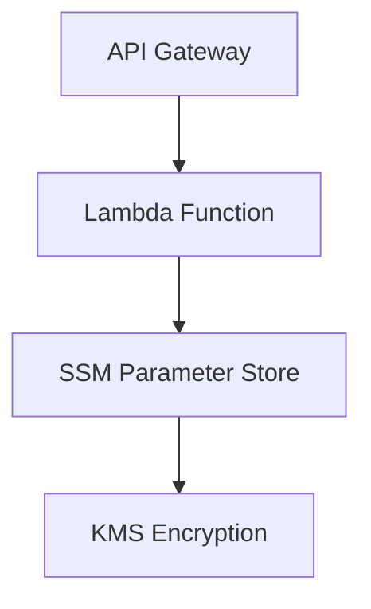

# Dynamic String API Project

## Overview
A serverless API that serves a dynamically updatable encrypted string from AWS SSM Parameter Store.

## Architecture




## Key Components
- AWS Lambda (Python 3.12 runtime)
- API Gateway HTTP API
- SSM Parameter Store with KMS encryption
- IAM roles with least-privilege permissions
- Terraform infrastructure as code

## Prerequisites
- AWS account credentials configured
- OpenTofu 1.6+ installed
- AWS CLI v2 installed

## Deployment
```bash
# Initialize Terraform
tofu init

# Apply configuration (auto-approve for CI/CD)
tofu apply -auto-approve
```

## Usage
### Access API Endpoint
```bash
curl https://d5pmh5sua1.execute-api.eu-west-1.amazonaws.com
```

### Update Dynamic String
```bash
aws ssm put-parameter \
  --name "/merapar/dynamicString" \
  --value "NewStringValue" \
  --type SecureString \
  --overwrite
```

### Destroy Resources
```bash
tofu destroy
```

## Security
- All parameters stored as SecureString with KMS encryption
- IAM roles grant least privilege access
- Automatic key rotation enabled
- Infrastructure changes tracked in version control