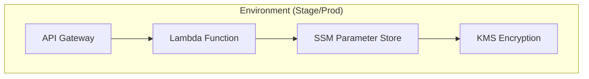

# Dynamic String API Project (Multi-Environment)

## Overview
A serverless API that serves a dynamically updatable encrypted string from AWS SSM Parameter Store. This project is configured for `stage` and `prod` environments, each with its own isolated state and resources, deployed via GitHub Actions.

## Architecture
The core architecture remains the same for each environment (stage/prod):



Terraform state for each environment is stored in separate S3 buckets with DynamoDB for locking. IAM roles for GitHub Actions are configured with least-privilege access per environment.

## Project Structure
The project is organized into several Terraform configurations:
-   **Root (`./`)**: Contains the main application infrastructure definition (API Gateway, Lambda, application-specific KMS key, SSM Parameter). This is deployed by GitHub Actions.
-   **`bootstrap/`**: Defines the S3 buckets and DynamoDB tables used for Terraform's remote state backend for each environment. This is applied manually once per AWS account/region.
-   **`iam-for-github-actions/`**: Defines the IAM OIDC provider for GitHub and the IAM roles that GitHub Actions will assume for deploying `stage` and `prod` environments. This is applied manually once per AWS account.

## Key Components
-   AWS Lambda (Python 3.12 runtime)
-   API Gateway HTTP API
-   Environment-specific SSM Parameter Store with KMS encryption
-   Environment-specific IAM roles for Lambda execution
-   IAM roles for GitHub Actions with least-privilege permissions per environment
-   Terraform infrastructure as code (OpenTofu)
-   GitHub Actions for CI/CD

## Prerequisites
-   AWS account.
-   GitHub repository where this code resides.
-   OpenTofu 1.6+ installed locally (for initial setup).
-   AWS CLI v2 installed locally (for initial setup and manual operations).

## Initial Setup (One-Time Manual Steps)

These steps are required to prepare your AWS account and GitHub repository for deployments.

### 1. Configure IAM Roles for GitHub Actions
This Terraform configuration sets up the OIDC provider and IAM roles that GitHub Actions will use.
   ```bash
   cd iam-for-github-actions/
   
   # The variables.tf file now has defaults for alanops/merapar-tech-test-dynamic-string.
   # If your GitHub org/repo names are different, update variables.tf or use a terraform.tfvars file.

   tofu init
   tofu apply 
   ```
   Take note of the output ARNs for `github_stage_role_arn` and `github_prod_role_arn`.

### 2. Configure GitHub Secrets
In your GitHub repository settings (under "Secrets and variables" > "Actions"), add the following repository secrets:
-   `AWS_ROLE_STAGE_ARN`: The ARN outputted as `github_stage_role_arn` from the previous step.
-   `AWS_ROLE_PROD_ARN`: The ARN outputted as `github_prod_role_arn` from the previous step.

### 3. Configure Terraform Backend Resources (S3 & DynamoDB)
This Terraform configuration sets up the S3 buckets and DynamoDB tables for storing Terraform state for each environment.
   ```bash
   cd ../bootstrap/ # Navigate from iam-for-github-actions to bootstrap
   tofu init
   tofu apply
   ```
   This creates `merapar-terraform-state-stage`, `merapar-terraform-locks-stage`, `merapar-terraform-state-prod`, and `merapar-terraform-locks-prod`.

## Deployment (via GitHub Actions)

Application infrastructure for `stage` and `prod` environments is deployed using the "OpenTofu Deploy (simple)" GitHub Actions workflow.
1.  Navigate to the "Actions" tab in your GitHub repository.
2.  Select the "OpenTofu Deploy (simple)" workflow.
3.  Click "Run workflow".
4.  Choose the environment (`stage` or `prod`) you want to deploy to.
5.  Click "Run workflow" to start the deployment.

The workflow will:
-   Assume the appropriate IAM role (`AWS_ROLE_STAGE_ARN` or `AWS_ROLE_PROD_ARN`).
-   Initialize Terraform with the correct environment-specific backend configuration.
-   Run `tofu plan` and `tofu apply`.

## Usage

### Access API Endpoint
The API endpoint URLs for the deployed environments are:
```bash
# Stage Environment API Endpoint
curl https://ay2qqz9ay7.execute-api.eu-west-1.amazonaws.com/

# Prod Environment API Endpoint
curl https://c6mnuryiaa.execute-api.eu-west-1.amazonaws.com/
```
These URLs are also available as outputs from the GitHub Actions deployment workflow.

### Update Dynamic String
Use the AWS CLI, ensuring you specify the correct, environment-specific parameter name:
```bash
# For stage environment
aws ssm put-parameter \
  --name "/merapar/stage/dynamicString" \
  --value "NewStageStringValue" \
  --type SecureString \
  --overwrite

# For prod environment
aws ssm put-parameter \
  --name "/merapar/prod/dynamicString" \
  --value "NewProdStringValue" \
  --type SecureString \
  --overwrite
```

## Destroy Resources

### Application Resources (Stage/Prod)
Application resources for a specific environment can be destroyed using the "OpenTofu Destroy" GitHub Actions workflow.
1.  Navigate to the "Actions" tab.
2.  Select the "OpenTofu Destroy" workflow.
3.  Click "Run workflow".
4.  Choose the environment (`stage` or `prod`) to destroy.
5.  Click "Run workflow".

### Backend and IAM Setup Resources (Manual)
The resources created by the `bootstrap/` and `iam-for-github-actions/` configurations are managed manually. To destroy them:
1.  **IAM for GitHub Actions:**
    ```bash
    cd iam-for-github-actions/
    tofu destroy
    ```
2.  **Bootstrap (Backend Resources):**
    ```bash
    cd ../bootstrap/
    tofu destroy
    ```
    **Note:** Ensure S3 buckets are empty before attempting to destroy them. Terraform might require manual emptying if objects or versions exist.

## Security
-   All parameters stored as SecureString with environment-specific KMS encryption.
-   IAM roles (for Lambda execution and GitHub Actions) grant least privilege access per environment.
-   Automatic key rotation enabled for KMS keys.
-   Infrastructure changes tracked in version control and deployed via CI/CD.